<div align="center">



### The offline, peer-to-peer, on-device-AI football watch-party — with on-chain USDT betting.

**No servers. No cloud AI. No custodians. No API keys leaving your machine.**

_Built for the [Tether Developers Cup](https://dorahacks.io/hackathon/tether-developers-cup/detail) — using **all three** tracks of the Tether open-source stack._

`▸ Pears (P2P)` · `▸ QVAC (Local AI)` · `▸ WDK (Wallets)`

</div>

---

```
 ┌─ pitchside ──────────────────────────────────── ● ● ● ─┐
 │                                                          │
 │   67'  ⚽ GOAL — Saka for Arsenal. ARS 2–1 CHE           │
 │   67'  🎙 AI  What a strike! The Emirates ERUPTS —       │
 │              Saka cuts inside and buries it far post!    │
 │                                                          │
 │   🎲 bet #3 · Will Arsenal hold on to win?               │
 │        Yes (120 USDT · 71%)   No (48 USDT · 29%)         │
 │        [ Join ]   🤖 AI odds   ✔ Confirm winner          │
 │                                                          │
 │   @sam  turn your wifi off and watch it still sync 👀    │
 └──────────────────────────────────────────────────────────┘
```

---

## 📖 The one-liner

**PitchSide is a football watch-party that works even when the internet is off.**
Fans form a serverless peer-to-peer mesh, an AI commentator runs _entirely on your
own device_, and you can open and settle **USDT bets** on the match from a wallet
where _you_ hold the keys. It's the whole Tether stack, pointed at the one thing
that reliably breaks the internet: everyone watching the same match at once.

> **Theme:** football & the global tournament moment.
> **Filter:** the theme. **The point:** the stack.

---

## 🎯 Why this fits _all three_ tracks

The Tether Developers Cup has three tracks — **Pears (P2P)**, **QVAC (Local AI)**,
and **WDK (Wallets)**. Most projects pick one. PitchSide is architected so each
track does something that is **genuinely hard to do any other way**:

| Track        | What it does in PitchSide                                                                                                          | Why it _has_ to be this stack                                                                                                                            |
| ------------ | ---------------------------------------------------------------------------------------------------------------------------------- | -------------------------------------------------------------------------------------------------------------------------------------------------------- |
| **🛰️ Pears** | Serverless watch-party rooms: peers sync a shared match feed + chat + reactions with **no server**.                                | A stadium's cell network dies at kickoff. P2P over Hyperswarm/Hypercore keeps the party alive on local WiFi with the internet off.                       |
| **🧠 QVAC**  | An on-device LLM generates **live commentary** and answers fan questions — no cloud, no API keys, inference on the user's machine. | Commentary must be instant and private; the "money shot" is a private AI hyping a goal with the internet disconnected.                                   |
| **💳 WDK**   | A **self-custodial** wallet + a non-custodial USDT escrow for peer-to-peer match betting. Users hold their own seed.               | Fans bet against _each other_, not the house. WDK gives every fan a real EVM wallet; the escrow enforces payouts on-chain — no one holds anyone's money. |

**The synthesis:** a goal happens → the on-device **AI** commentates it → the event
**syncs peer-to-peer** to everyone in the room → and the bet on that outcome
settles in **USDT** from **self-custodial** wallets. Three tracks, one moment.

---

## ✨ Features

- **🛰️ Serverless watch-party** — type a room name, share a `PS1-…` invite code, and
  peers sync a live match feed. Internet-P2P (DHT discovery, join from anywhere) **or**
  local-network mode (same WiFi, fully offline).
- **🧠 On-device AI commentary & Q&A** — download a local GGUF model once
  (`Llama-3.2-1B-Instruct`, ~773 MB); it commentates match events in one of three
  personas (Hype 🔥 / Analyst 🧠 / Banter 😏) and answers "was that offside?" — all
  on your machine, no cloud.
- **📡 Real live matches (optional)** — plug a free football-data.org key and _follow_
  a real match; goals/kickoff/full-time auto-post and the **local AI commentates the
  real game**. (Internet is used only for the _data_; inference stays on-device.)
- **💳 Self-custodial betting** — a WDK wallet generated & held on-device. Open a bet,
  and it appears as a **card in the fan chat** for every peer (chain-sourced, so
  _anyone_ can create one). Stake USDT, get **AI-computed odds**, and settle
  pari-mutuel with the pool split **5% DAO / 2% host / 93% winners** — enforced by a
  smart contract.
- **🧪 In-app test faucet** — one click for test gas + test USDT on a local chain, so
  the whole flow is demoable without a terminal.
- **🛡️ Host moderation** — the room host can delete any chat message, feed event, **or
  bet card**; deletes broadcast to every peer (bet deletes also void the escrow
  on-chain, enabling refunds).
- **🎨 Framed-terminal UI** — a clean, modern, monospace, phosphor-green terminal
  aesthetic, consistent with the [companion mobile build](#-siblings--related-work).

---

## 🏗️ Architecture

PitchSide is a **Pear v2 desktop app** (`pear-runtime` embedded in Electron). The
**renderer** owns the DOM and the wallet; a **Bare worker** owns the P2P mesh and the
on-device AI. They speak a tiny newline-delimited JSON protocol over the Pear bridge.

```
┌──────────────────────────────── ELECTRON (renderer, Chromium) ───────────────────────────────┐
│                                                                                                │
│   renderer/                                                                                     │
│    ├─ app.js ............ orchestrates views + wallet + worker IPC                              │
│    ├─ ui/feed-view.js ... live match feed (host-deletable rows)                                │
│    ├─ ui/chat-view.js ... fan chat (host-deletable rows)                                        │
│    ├─ ui/bet-cards.js ... 🎲 BET CARDS render IN the chat, discovered from chain                │
│    ├─ ui/ai-panel.js .... "ask the AI" + model download UI                                      │
│    ├─ wallet.js ......... 💳 WDK self-custodial wallet + escrow calls  (bundled by esbuild)     │
│    └─ live-data.js ...... optional football-data.org → match events                            │
│                                                                                                │
│    window.bridge  (preload IPC)          │  ▲                        │ ethers reads/writes      │
│         │ JSON frames                     │  │                        ▼                          │
└─────────┼─────────────────────────────────┼──┼──────────────── BNB Smart Chain / local node ───┘
          ▼                                  │  │                  (PitchSideBets.sol escrow)
┌──────── BARE WORKER (workers/pitchside.js) │  │
│                                            │  │
│   lib/room.js ........ room lifecycle; host-only writes                                        │
│   lib/feed.js ........ shared-key Hypercore match feed (append-only, tombstone deletes)        │
│   lib/transport.js ... SwarmTransport  (Hyperswarm — internet P2P)                             │
│   lib/direct-transport.js  DirectTransport  (LAN, offline, same WiFi)                           │
│   lib/mesh-transport.js .. MeshTransport   (stadium mesh seam — see MESH.md)                    │
│   lib/qvac.js ........ 🧠 on-device AI (QVAC llama.cpp) — commentary, Q&A, bet odds/outcome     │
│   lib/prompts.js ..... persona + odds + outcome prompt templates                               │
└────────────────────────────────────────────────────────────────────────────────────────────────┘
```

**Two golden rules keep the tracks clean:**

1. **P2P is the transport, the chain is the truth.** Chat/feed/reactions live on the
   Hypercore feed (fast, offline-capable). _Money_ — stakes, pools, payouts — lives
   on-chain. Bet cards are **discovered from the contract**, so any peer can create a
   bet and it appears in everyone's chat with **no multi-writer rewrite**.
2. **AI never leaves the device.** The football _data_ may come over HTTPS, but every
   token of inference runs locally through QVAC. No cloud AI, no API keys.

---

## 🧰 Tech stack — what I used, and how

### 🛰️ Pears (P2P) — `pear-runtime` + Hyperswarm + Hypercore

The watch-party is a **shared-key Hypercore** feed: every peer derives the _same_
core from the room name, the host writes match/chat/reaction events, guests replicate
read-only. Discovery + connectivity is **Hyperswarm** (DHT) for internet mode, or a
**direct TCP** transport for offline same-WiFi mode — swapped behind one interface
without touching the data layer.

- `pear-runtime` embedded in Electron (Pear v2 desktop model)
- `hyperswarm`, `hypercore`, `corestore`, `hypercore-crypto`, `b4a`, `framed-stream`
- Deletes are **append-only tombstones** (you can't erase a Hypercore, so the host
  appends a `delete` marker keyed by the event's `seq`, and every peer hides it).
- **Multi-hop stadium mesh** is designed and _proven_ (`experiments/`) with the native
  radio layer left as a clean seam (`MeshTransport`). See [`MESH.md`](MESH.md).

### 🧠 QVAC (Local AI) — `@qvac/bare-sdk` + `@qvac/llm-llamacpp`

On-device inference runs inside the Bare worker. QVAC's llama.cpp plugin loads a
GGUF model directly from Hugging Face over HTTPS (one-time ~773 MB), then runs
**100% locally**:

- **Live commentary** on match events (3 personas)
- **Fan Q&A** grounded in recent match events
- **Betting odds** (implied probabilities per outcome) and **outcome proposals**
  (grounded in the real match result when available) — returned as strict JSON the UI
  parses deterministically
- Model: `unsloth/Llama-3.2-1B-Instruct-GGUF` (`Q4_0`, `ctx_size: 2048`)
- **QVAC-track rule honored:** _all_ AI (inference, odds, outcome) is on-device; the
  only network use is fetching the optional football data feed.

### 💳 WDK (Wallets) — `@tetherto/wdk-wallet-evm` + a Solidity escrow

Every fan gets a **self-custodial** EVM wallet via WDK: a BIP-39 seed, generated and
stored **on-device** (the user holds their keys — the whole point of the Wallets
track). The app talks to a non-custodial escrow contract entirely through WDK:

- `WalletManagerEvm` + `SeedSignerEvm` → seed → account → address
- `account.getTokenBalance()` for USDT, `account.approve()` for staking
- `account.sendTransaction({ to, data })` with **ethers-encoded calldata** to call the
  escrow's custom methods (`createBet` / `joinBet` / `confirmResult` / `claim` / …)
- Target chain is chosen purely by the RPC we hand WDK (BSC testnet → chainId 97;
  local Hardhat → 31337) — no hardcoded chain list.
- **Hardened for real EVM behavior:** explicit monotonic nonce management + a send
  mutex + receipt polling (WDK returns after _broadcast_, not mining — naive
  integrations hit "nonce too low" and hangs under instant automining; PitchSide
  doesn't).

**The contract — [`PitchSideBets.sol`](contracts/contracts/PitchSideBets.sol):**
a non-custodial, **pari-mutuel** USDT escrow.

- Stakes live in the contract, never an app wallet.
- Winners split the pool pro-rata; **AI odds are informational**.
- **Host-gated resolution:** anyone can relay the AI's proposed outcome
  (`proposeResult`), but only the bet's host can `confirmResult` — and only after an
  optional dispute window. Fees are hard-coded: **5% DAO + 2% host + 93% winners**.
- Safety: `SafeERC20`, `ReentrancyGuard`, checks-effects-interactions, pull-based
  `claim`/`refund`, and a `cancelBet → refund` path so funds are never stranded.
- Tooling: **Hardhat 2** + **OpenZeppelin v5** + `ethers` v6.

### 🎨 Everything else

`electron` + `electron-forge` (packaging), `esbuild` (bundles the WDK/ethers/bip39
wallet for the sandboxed renderer, with a `Buffer` polyfill inject), vanilla
JS + a hand-rolled DOM helper (no framework), and a pure-CSS framed-terminal theme.

---

## 🚀 Quick start

### Prerequisites

- **Node.js 20+** and **npm**
- A display (it's an Electron desktop app)
- ~1 GB free for the optional AI model

### 1) Install & run the watch-party

```bash
git clone https://github.com/LEarnX-Official/PitchSide.git
cd PitchSide
npm install
npm start          # builds the wallet bundle (prestart) + launches the app
```

In the app: pick a nickname → **Join watch-party** → optionally **download the AI
model** in the AI panel → post match events / ask the AI. Run a **second instance**
with the same room name to see peer-to-peer sync. **For the money shot: turn your
internet off first** (choose _Local network_ mode).

### 2) Enable betting (optional, ~2 min, no real money)

Betting talks to a chain. The easiest path is a **local Hardhat node** — no faucet,
no real key:

```bash
# terminal A — a persistent local chain
cd contracts && npm install
npx hardhat node                                   # 127.0.0.1:8545, chainId 31337

# terminal B — deploy the escrow + a mock USDT
cd contracts
npx hardhat run scripts/deploy.js --network localhost
#   → writes deployments/localhost.json + renderer/contract/deployment.js
```

Then (re)start the app (`npm start`, or type `rs` in a running forge session). In the
🎲 **Match betting** panel: **Create new wallet** → **⛽ Get test gas** →
**🪙 Get test USDT** → open a bet (it appears in the fan chat) → **Join** → as host,
**🤖 AI decide winner** → **✔ Confirm** → **💰 Claim**.

> Prefer BSC testnet? Put a funded key + RPC in `contracts/.env` and run
> `npm run deploy:testnet`. See [`contracts/README.md`](contracts/README.md).

---

## 🧪 Tests & proofs — _verified, not vibes_

Everything load-bearing is tested, and the P2P + on-chain flows are proven
end-to-end.

```bash
npm test                 # 40 app tests: feed, room, transport, multi-hop mesh,
                         #                prompts, join-code, live-data, betting-AI,
                         #                host-delete tombstones (chat/feed/bet)

npm run test:contracts   # 23 contract tests: fee math, host gate, dispute window,
                         #                     cancel/refund, reentrancy attack
```

**End-to-end on a real chain** — drives the _actual bundled WDK wallet_ through the
full lifecycle against a live Hardhat node, asserting the on-chain payout
(139.5 USDT of a 150 pool = 93% to the sole winner):

```bash
cd contracts
npx hardhat node                                        # (separate terminal)
npx hardhat run scripts/deploy.js --network localhost
npx hardhat test test/wallet-e2e.test.js --network localhost
```

**Runnable P2P mesh proofs** (no app, no server):

```bash
node experiments/multihop-mesh-proof.js    # A→B→C relay (A & C never linked)
node experiments/mesh-chain-selfheal.js    # 5-node chain + self-healing reroute
node experiments/room-over-mesh.js         # the real Room over a mesh transport
```

| Suite                         | Count          | Covers                                                                                            |
| ----------------------------- | -------------- | ------------------------------------------------------------------------------------------------- |
| App (`node --test`)           | **40 passing** | P2P feed/room/transport, multi-hop mesh, AI prompts/JSON, join codes, betting-AI, host moderation |
| Contracts (Hardhat)           | **23 passing** | escrow lifecycle, exact fee math, reentrancy, refunds                                             |
| Wallet E2E (Hardhat + bundle) | ✅             | create→join→propose→confirm→claim payout against a live chain                                     |

---

## 📂 Project layout

```
pitchside-v2/
├─ electron/               Electron shell + pear-runtime worker host + preload IPC
├─ renderer/               UI (framed-terminal), WDK wallet, bet cards, live-data
│  ├─ app.js               orchestrator
│  ├─ wallet.js            WDK self-custodial wallet + escrow calls (→ esbuild bundle)
│  ├─ ui/                  feed-view, chat-view, bet-cards, ai-panel, betting-panel
│  └─ contract/            deployment.js + exported ABIs (generated)
├─ workers/                Bare worker: P2P mesh + on-device AI
│  ├─ pitchside.js         worker entry: routes JSON IPC commands
│  └─ lib/                 room, feed, transports (swarm/direct/mesh), qvac, prompts
├─ contracts/              Solidity escrow (Hardhat)
│  ├─ contracts/           PitchSideBets.sol + test/MockUSDT.sol + test/ReentrantToken.sol
│  ├─ scripts/             deploy.js, fund.js (faucet), export-abi.js
│  └─ test/                unit tests + bundled-wallet e2e
├─ experiments/            runnable multi-hop mesh proofs
├─ BETTING-PLAN.md         the betting design + build log
└─ MESH.md                 stadium-mesh design + what's left
```

---

## 🔒 Security & honesty

This is a hackathon build. Some things are demo-grade **on purpose**, and they're
called out rather than hidden:

- **Seed at rest** — the WDK seed is stored in `localStorage` **in plaintext** for the
  demo, with a one-time backup prompt + on-demand "Show seed". _Not safe for real
  funds_ — encrypting at rest (passphrase-derived key / OS keystore) is the first
  pre-mainnet hardening item.
- **Not audited** — `PitchSideBets.sol` is tested (incl. a reentrancy attack) but
  **not audited**. Testnet / mock USDT only until it is.
- **Host moderation is a "hide," not an "erase"** — the Hypercore feed is append-only,
  so a delete broadcasts a tombstone every peer applies; the original bytes remain in
  history. Bet deletes additionally void the escrow on-chain (enabling refunds).
- **Stadium mesh radio layer** — the multi-hop _relay_ is proven; the phone-to-phone
  _radio_ transport (Nearby / WiFi-Direct) is a native module still to build.
  `MeshTransport` is the clean seam for it.

---

## 🧭 Siblings & related work

- **`pitchside-mobile`** — a companion React Native (Expo) build (separate repo),
  same architecture and framed-terminal design language (two-worklet split: a Bare
  worklet for P2P + QVAC's official RN path for AI).
- **[`BETTING-PLAN.md`](BETTING-PLAN.md)** — the full betting design doc + build log.
- **[`contracts/README.md`](contracts/README.md)** — contract details, deploy, and the
  local-chain e2e walkthrough.
- **[`MESH.md`](MESH.md)** — the offline stadium-mesh design.

---

## 🏆 The Cup

Built for the **Tether Developers Cup** — a knockout-tournament hackathon
(8,000 USDt pool: 1,000 per track + 5,000 Cup Champion). PitchSide targets **all
three tracks at once**, because the whole point is the synthesis: _an offline,
private, self-custodial way to watch — and bet on — the match with your friends._

<div align="center">

**No servers. No cloud AI. No custodians.**
**Just you, your friends, the match, and the whole Tether stack.**

`▸ turn the wifi off and watch it still work`

</div>

## 📜 License

[MIT](LICENSE) — a permissive open-source license, per the Cup's submission rules.
